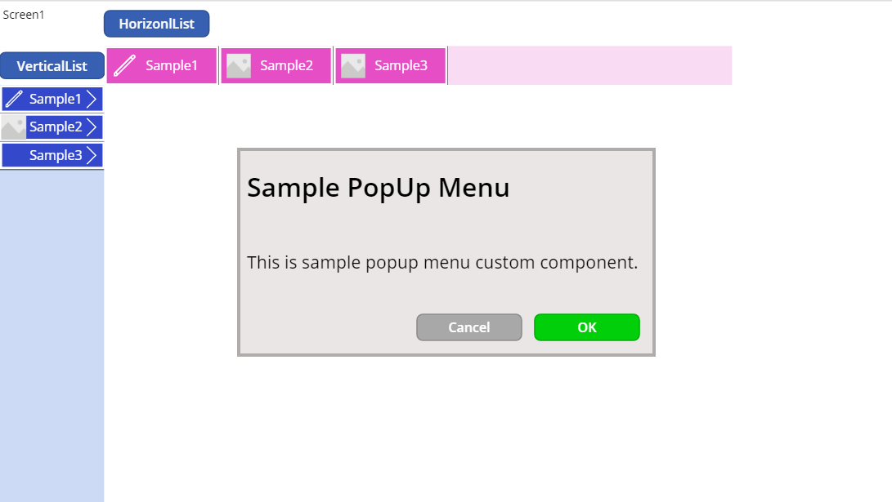
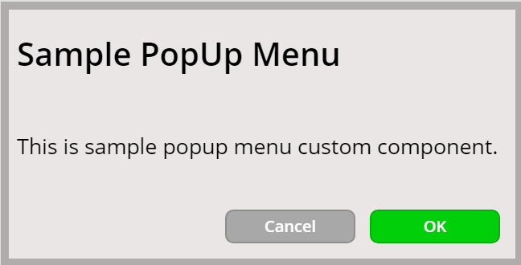
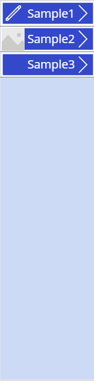
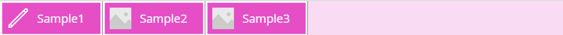

# CustomMenuComponents

## Summary

This component is Custom Menu Components.

## Applies to

* Power Apps Canvas app

## Compatibility

## Prerequisites

None

## Solution

Solution|Author(s)
--------|---------
CustomMenuComponents | [korune](https://github.com/korune) ([@koruneko32767](https://twitter.com/koruneko32767))

## Version history

Version|Date|Comments
-------|----|--------
1.0|March 14, 2021|Initial release

## Disclaimer

**THIS CODE IS PROVIDED *AS IS* WITHOUT WARRANTY OF ANY KIND, EITHER EXPRESS OR IMPLIED, INCLUDING ANY IMPLIED WARRANTIES OF FITNESS FOR A PARTICULAR PURPOSE, MERCHANTABILITY, OR NON-INFRINGEMENT.**

---

## Minimal Path to Awesome

* [Download](https://github.com/pnp/powerfx-samples/raw/main/samples/convertbasenumber-functions/solution/convertbasenumber-functions.msapp) the `.msapp` from the `solution` folder
* Use the `.msapp` file using **File** > **Open** > **Browse** within Power Apps Studio.

## Using the Source Code

  You can also use the [Power Apps Source Code tool](https://github.com/microsoft/PowerApps-Language-Tooling) to the code using these steps:
* Clone the repository to a local drive
* Pack the source files back into `.msapp` file:
  * [Power Apps Tooling Usage](https://github.com/microsoft/PowerApps-Language-Tooling)
* Use the `.msapp` file using **File** > **Open** > **Browse** in Power Apps Studio.

## Features

This sample includes following features:

* Pop-Up Menu
* Vertical List Menu
* Horizon List Menu

## Functions

### PopUpMenu

This component is used to create a pop-up menu.  

#### Syntax

##### Input

| Parameter | Description | Default | Type |
---|---|---|--
| BackGroundFill | Background color | RGBA(235, 230, 230, 1) ■ | Color |
| BackGroundBorderColor | Color of outer frame | ColorFade(Self.BackGroundFill, -25%) ■ | Color |
| BackGroundBorderThickness | Thickness of outer frame | 10 | Number |
| OKMessage | Text string to be displayed on the OK button | "OK" | Text |
| OKButtonFill | Background color of OK button | RGBA(0, 207, 10, 1) ■ | Color |
| OKButtonColor | Text color of OK button | RGBA(255, 255, 255, 1) ■ | Color |
| CancelMessage | Text string to be displayed on the Cancel button | "Cancel" | Text |
| CancelButtonFill | Background color of Cancel button | RGBA(168, 168, 168, 1) ■ | Color |
| CancelButtonColor | Text color of Cancel button | RGBA(255, 255, 255, 1) ■ | Color |
| TitleMessage | String to display in the title | "Sample PopUp Menu" | Text |
| TitleMessageColor | Title text color | RGBA(0, 0, 0, 1) ■ | Color |
| TitleMessageFontSize | The size of the text | 30 | Number |
| BodyMessage | String to display in the title | "This is sample popup menu  custom component." | Text |
| bodyMessageColor | Text color | RGBA(0, 0, 0, 1) ■ | Color |
| BodyMessageFontSize | The size of the text | 20 | Number |

#### Output

None

#### Example

### VerticalListMenu

This component is used to create a vertical list menu.  

#### Syntax

##### Input

| Parameter | Description | Default | Type |
---|---|---|--
| ListMenuTitle | List of menus | Table( &ensp;{_id:1, Icon:Icon.Edit, Title:"Sample1"}, &ensp;{_id:2, Image:SampleImage, Title:"Sample2"}, &ensp;{_id:3, Title:"Sample3"} ) | Table |
| TitleColor | Title text color | RGBA(255, 255, 255, 1) ■ | Color |
| BackGroundFill | Background color of the list | RGBA(1, 72, 202, 0.2) ■ | Color |
| TitleBackGroundFill | Background color of the title | RGBA(51, 72, 202, 1) ■ | Color |
| TitleBackGroundBorderColor | Color of the outer frame of the title | RGBA(255, 255, 255, 1) ■ | Color |
| TitleBackGroundBorderThickness | Thickness of the outer frame of the title | 3 | Number |
| SeparationHeight | Height of the dividing line | 1 | Number |
| TitleFontSize | Size of the title text | 15 | Number |

##### Behavior

| Parameter | Description |
---|---
| ListMenuBehavior | What to do when each list is selected

#### Output

Number \*

\* This output is set up for internal use and is not intended to be used by users.

#### Example

### HorizonListMenu

This component is used to create a Horizon list menu.  

#### Syntax

##### Input

| Parameter | Description | Default | Type |
---|---|---|--
| ListMenuTitle | List of menus | Table( &ensp;{_id:1, Icon:Icon.Edit, Title:"Sample1"}, &ensp;{_id:2, Image:SampleImage, Title:"Sample2"}, &ensp;{_id:3, Title:"Sample3"} ) | Table |
| TitleColor | Title text color | RGBA(255, 255, 255, 1) ■ | Color |
| BackGroundFill | Background color of the list | RGBA(230, 78, 198, 0.2) ■ | Color |
| TitleBackGroundFill | Background color of the title | RGBA(230, 78, 198, 1) ■ | Color |
| TitleBackGroundBorderColor | Color of the outer frame of the title | RGBA(255, 255, 255, 1) ■ | Color |
| TitleBackGroundBorderThickness | Thickness of the outer frame of the title | 3 | Number |
| SeparationWidth | Width of the dividing line | 1 | Number |
| TitleFontSize | Size of the title text | 15 | Number |

##### Behavior

| Parameter | Description |
---|---
| ListMenuBehavior | What to do when each list is selected

#### Output

Number \*

\* This output is set up for internal use and is not intended to be used by users.

#### Example

