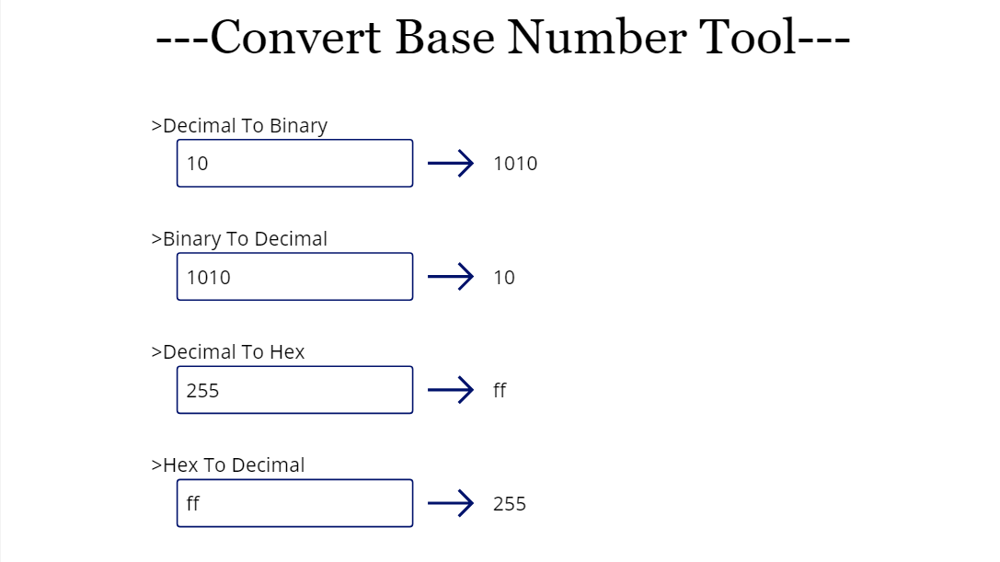
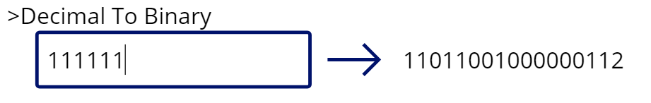
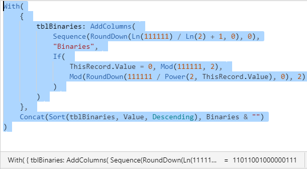

# List of components in my library


* [HexToDecimal](https://github.com/koruneko/PowerApps-Custom-Functions#HexToDecimal)
* [DecimalToHex](https://github.com/koruneko/PowerApps-Custom-Functions#DecimalToHex)
* [BinaryToDecimal](https://github.com/koruneko/PowerApps-Custom-Functions#BinaryToDecimal)
* [DecimalToBinary](https://github.com/koruneko/PowerApps-Custom-Functions#DecimalToBinary)

# HexToDecimal
This function is used to convert hex to decimal.  

This function was created based on the one created by Hiro.  
https://github.com/mofumofu-dance/PowerApps365/raw/master/Samples/Custom%20functions%20sample.msapp

## Syntax
```
HexToDecimal(Hex)
```

* Hex - Required. Text. Hex that you want to convert to decimal.

# DecimalToHex
This function is used to convert decimal to hex.  

## Syntax
```
DecimalToHex(Decimal)
```

* Decimal - Required. Number. Decimal that you want to convert to hex.  

# BinaryToDecimal
This function is used to convert binary to decimal.  

## Syntax
```
BinaryToDecimal(Binary)
```

* Binary - Required. Number. Binary that you want to convert to decimal.  

# DecimalToBinary
This function is used to convert decimal to binary.  

## Syntax
```
DecimalToBinary(Decimal)
```

* Decimal - Required. Number. Decimal that you want to convert to binary.  

# Bugs I am aware of
I'm aware of that bugs.  
If you have any suggestions for fixes, please let me know.  

## decimal to hex conversion
The following formula is used for decimal to hex conversion,  

[tex: \frac{\ln{(Decimal)}}{\ln{(16)}}]  

Set a value higher than [tex: 16^{12} - 1] in `Decimal`, you will not get accurate results.  
This is because of the cancellation of significant digits.

[tex: \frac{\ln{(Decimal)}}{\ln{(16)}} = 11.999999999999998718629398474031]  
but calculate this in Power Apps, we get  
`Ln(281,474,976,710,655) / Ln(16) = 12` 

## decimal to binary conversion
When converting from decimal to binary, `2` may be output in the result.  



I suspected a logic error, but I wrote the formula for this function in the app, and it returned the expected result.  



I have yet to find a common denominator between these events.  

If you know anything about this, please let me know.   